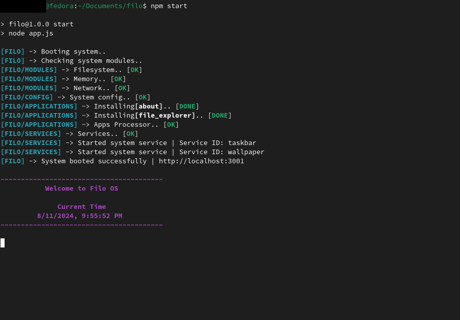
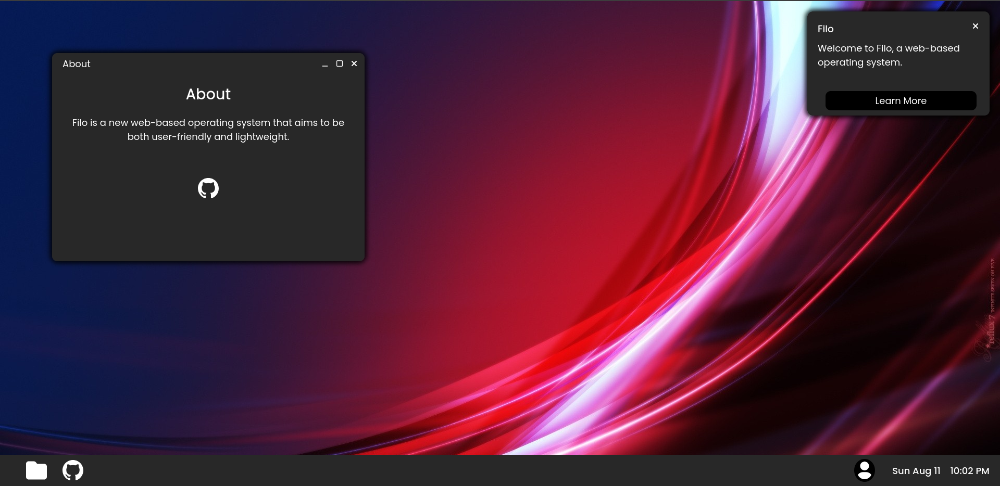

> [!WARNING]
> Filo is in an early developmental state, while each feature is tested before being released issues may still arise upon use. The developers of Filo or any related software are not responsible for anything that may occur to the host system or any other software or hardware components.
# Filo
Filo is a new web-based operating system that aims to be both user-friendly and lightweight.
## Goal
Filo was created with the goal of being a possible choice for a daily driver. The design is centered around portability and usability in order to provide a system suited for almost every use-case.
## Possible Use-Cases
- Running on a remote server or local machine and being used through a web browser
- Running on a remote server or local machine and being used through a custom Debian-based Linux distro in a web-wrapper
  - Essentially the main desktop environment for the system
## Installation Instructions
1. Clone this repository
     ```
     git clone https://github.com/FunnyGuy9796/filo.git
     cd filo
     ```
2. Configure the system by editing `config.json`
   - `port` - Defines which port Filo will run on
   - `services_path` - Defines where Filo services will be located on the host system
   - `apps_path` - Defines where Filo applications will be located on the host system
   - `network_required` - Defines whether a network connection is required to run Filo
3. After ensuring proper configurations run the following commands
     ```
     npm install
     npm start
     ```

4. Once the system has booted ensure that all components have started successfully and navigate to the URL printed to the terminal

## API Documentation - WIP
Including the Filo API in your project is as simple as include a script tag in your .ejs file.
#### `<script src="/js/filo-api.js"></script>`
### UI
#### filo.ui.launchApp()
Allows you to dynamically launch another app from within your app.
#### Syntax
```
filo.ui.launchApp()
filo.ui.launchApp(appId)
filo.ui.launchApp(appId, args)
filo.ui.launchApp(args)
```
#### Parameters
##### appId `(String)`
ID of the app. If not provided, a new instance of the current app will be launched.
##### args `(Object)`
Arguments to decide how the app is launched.
- `x` - The X position of the app window. `(in pixels)`
- `y` - The Y position of the app window. `(in pixels)`
- `width` - The width of the app window. `(in pixels)`
- `height` - The height of the app window. `(in pixels)`
- `isMax` - Determines whether the app should start maximized or not `(boolean)`
#### filo.ui.notify()
Allows you to display a notification on the desktop.
#### Syntax
```
filo.ui.notify(title, body)
filo.ui.notify(title, body, actionText, action)
```
#### Parameters
##### title `(String)`
Title to be displayed in the notification.
##### body `(String)`
Body to be displayed in the notification.
##### actionText `(String)`
Text to be displayed in the action button.
##### action `(Function)`
A function to be called when the action button is clicked.
- If no action is provided the action button will not be visible.
#### filo.ui.tooltip()
Allows you to display a tooltip above an HTML element.
#### Syntax
```
filo.ui.tooltip(object, text)
```
#### Parameters
##### object `(DOM Element)`
The HTML element the tooltip is assigned to.
##### text `(String)`
The text displayed in the tooltip.
### MEM - TODO
### FS - TODO
### SYS - TODO